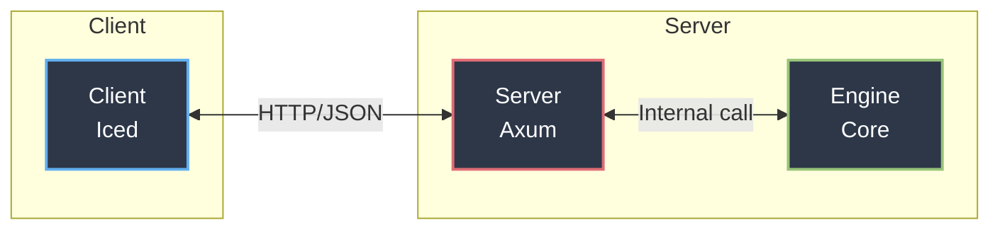

# simply-db

A lightweight, high-performance In-Memory Relational Database Management System (RDBMS) written in Rust, focused on ease of use.

The interaction between components goes like this:



## Core

### Data

Data in tables is laid out in rows. It supports the following data types:

- `BOOLEAN`
- `INT`
- `FLOAT`
- `TEXT`

> _(Note: Experimental `struct` support exists in some areas but is not fully integrated yet)._

### Query execution

Insertion, creation and deleting queries are pretty straightforward. Select and update queries run sequentially right now, because indexes are not implemented yet.

### SQL parsing

Includes two passes: tokenization and parsing. Parses all major CRUD operations: SELECT, INSERT, CREATE TABLE, UPDATE, DROP, TRUNCATE and DELETE. With some features missing like parsing `LIKE` statement.

### Synchronization

Thread safety and concurrency are implemented at the table level using `RwLock`. This ensures that multiple clients can read simultaneously, while only one writer can access a table at a time, guaranteeing stable database access.

## Server

The server is built with `axum` and exposes 4 main endpoints:

- **`GET /ping`** — Responds with plain text `"pong"`. Used for simple health checks.
- **`GET /health`** — Returns a JSON object with database metrics (currently: system time and `healthy` status).
- **`GET /v1/overview`** — Returns a JSON object containing all database tables and their respective schemas.
- **`POST /v1/query`** — Accepts a JSON payload with an SQL query string.
  - _Request example:_ `{"sql": "SELECT * FROM users"}`
  - _Response:_ A JSON array containing query execution results (supports multiple results depending on the sent query).

## Client

GUI application built with `iced-rs`.

> **Note:** The interface may appear laggy or unresponsive in `debug` mode due to `iced` debug overhead. Running in `--release` mode is highly recommended.

### How to use the Client:

1. Enter your server URL in the **DB connection** section on the sidebar.
2. Click on the URL to connect and select the database. Available tables will appear automatically.
3. Click on any table name on the left sidebar to render its contents in the main view.
4. Open the **Query** window in the primary area to execute custom SQL queries against the selected database.
5. Press **Enter** to submit your query.

> _Note: Data mutations will reflect in the UI only after clicking the `upd` (update) button._

## How to run

Note that to run anything you need to have atleast MSRV: `1.88`.

### Server

```sh
# Build release version
cargo build --bin server --release --features="server-deps"
# Move to binary directory
cd target/release
# Run executable with assigned listen ip
./server --listen-port 127.0.0.1:8080
```

### Client

```sh
cargo run --bin client --release --features="client-deps"
```

### Tests & Benchmarks

```sh
# Run tests
cargo test --workspace
# Run benchmarks
cargo bench --workspace
```
